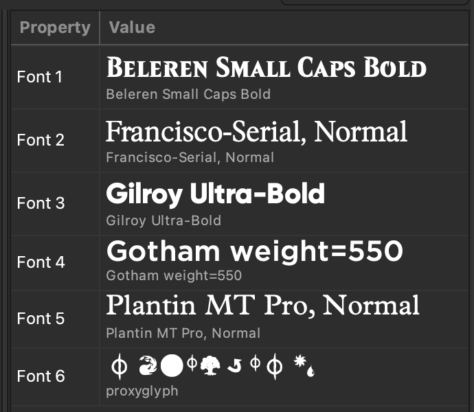
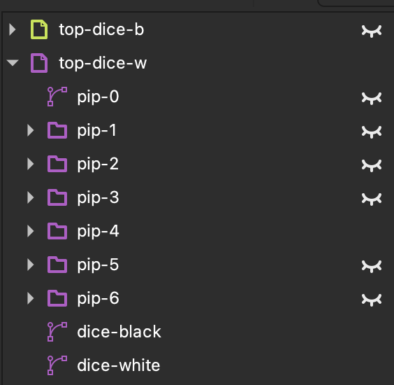
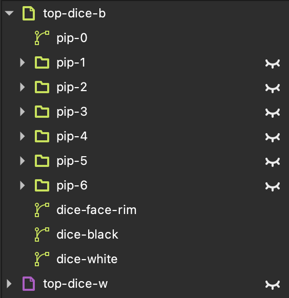

# Mood Swings custom card templates

These are [Inkscape](https://inkscape.org) templates for creating custom [Mood Swings](https://magic.wizards.com/en/news/announcements/introducing-mood-swings) cards. They're very close matches to Wizards of the Coast's Edition 1 printing. They're intentionally imperfect: one, because it's very hard to get a perfect match, and two, because they aren't intended for producing counterfeit cards.

## Installation/setup

You'll need some software and fonts to work with these templates.

Software:
- [Inkscape 1.4+](https://inkscape.org/release/)

Fonts:
- Beleren Small Caps Bold (card name)
- Plantin MT Pro (rules text)
- Gilroy Ultra-Bold (set symbol, rarity)
- Gotham (collation data)
- Francisco Serial (copyright notice)
- optional: Proxyglyph (if you need to edit the artist "brush" icon as text)

Obtaining fonts is left as an exercise for the reader.

## Working with a template

Each template has everything you need to reproduce any card of that color in Edition 1. You should hide and show layers or groups to use the values needed for your card.

### Top dice

The top dice are in layers called "top-dice-b" and "top-dice-w". `b` and `w` stand for black and white, respectively. Within each of those layers, there are seven faces: one through six pips plus a numeral zero, each represented as a group. To create a white dice, turn off the black layer (and vice versa). Within the color of dice you want, turn off all the faces you don't want, leaving just one visible. Below, we show examples of a white 4-pip face and a black 0-numeral face, along with what the layer control in Inkscape should look like.

| Dice face | Layer control |
|-----------|---------------|
|  |  |
|  |  |

### "!" reminder icon

Cards which require the exclamation point reminder icon can toggle on the layer called `reminder-icon`.

### Bottom dice

Bottom dice are much like top dice, but there are four options. The layers are named `bottom-dice-<color><number>`, where `<color>` can be "b" or "w" and `<number>` can be "1" or "2" (since there are black and white variants of both one and two dice). Of course, if your card design requires no bottom dice, you can turn off all four layers.

### Rarity

The four existing rarities are available in the `rarity` layer. They can be toggled on and off to present common, uncommon, rare, and mythic.

### Art

In layer `artbox`, replace `art-placeholder` with your desired artwork.

### Text

There are multiple text-based fields to update. The most obvious is the card's name, `top > cardname`. Several fields in the `collation` layer such as `color`, `setcode`, `collector`, and `artist-name` can be changed.

Editing the card rules text is a bit more involved. Here are the steps:

1. Update the text in `text > textbox-main` with all the rules text required. This should included formatting like bold and italics. Leave gaps for any inline dice.
2. If the card has single or double dice in the lower left, slide the right edge of `textbox > dice-spacer` to roughly match its bounds.
3. Use Inkscape's ["Set Subtraction Frames"](https://wiki.inkscape.org/wiki/index.php/Release_notes/1.2#Text_Tool) feature to flow text around the dice and spacers. Make sure to select `rules-text`, `left-spacer`, `right-spacer`, `collation-spacer`, and `top-spacer` for sure, and `dice-spacer` if the card includes lower-left dice. From the **Text** menu, choose _Set Subtraction Frames_. Then resize the top and left/right spacers to center the text on the card text box.
4. Copy/paste and unhide any needed dice glyphs to fill in gaps in the card text.
